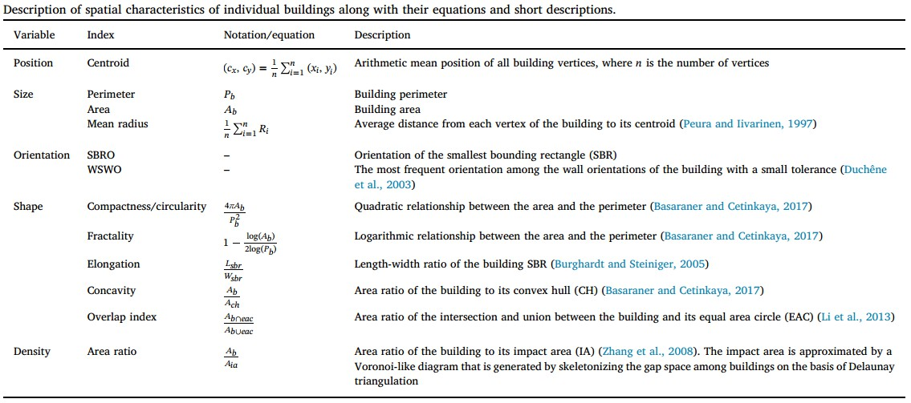
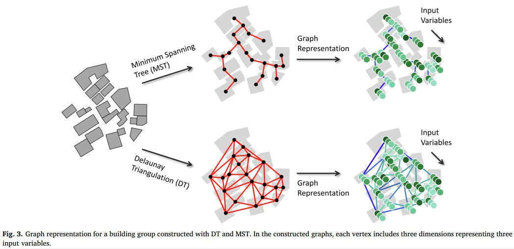
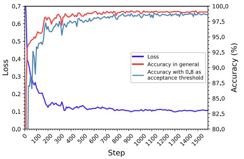
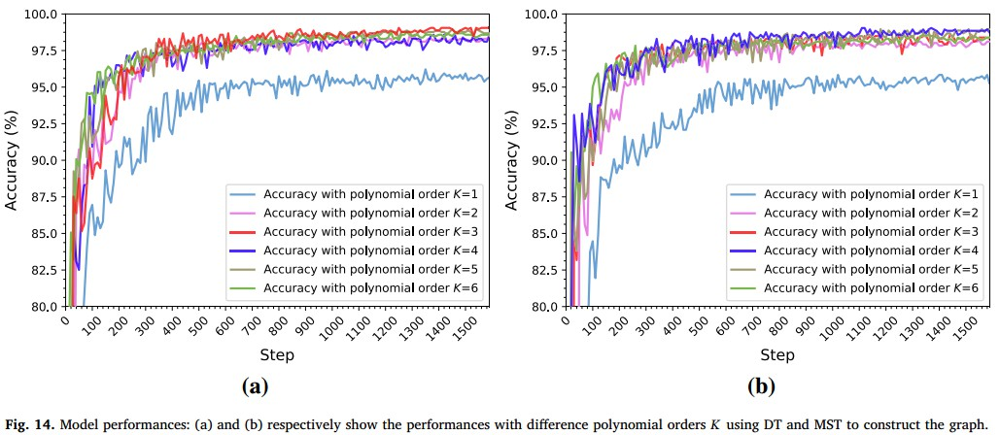
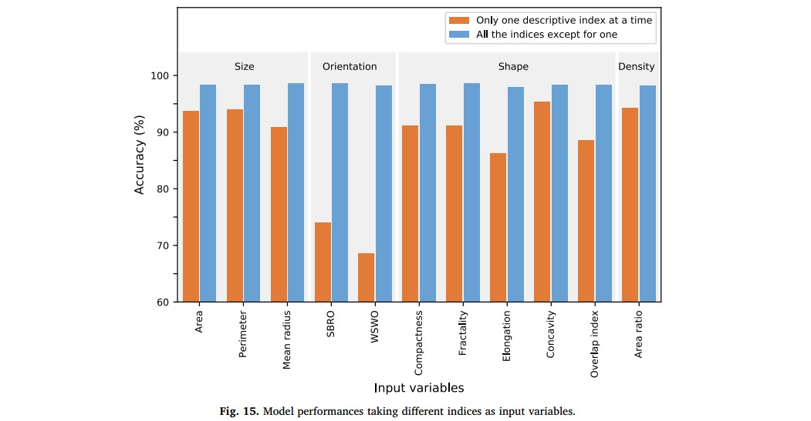
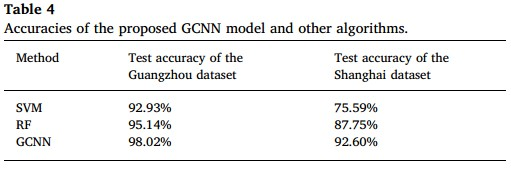

## A graph convolutional neural network for classification of building patterns using spatial vector data

### （使用空间矢量数据对建筑模式进行分类的图形卷积神经网络）

##### **研究主题：解决什么问题，以前的研究通常是怎样解决的**

本文通过提出的新的图卷积方法，对规则以及不规则建筑物模式进行区分。

以前的研究通常是设计规则并手动提取特定模式的特征，这样的建筑物模式分类和识别方法既费时又有局限性。

在建筑物模式自动识别中，现有的主要方法之一是基于规则的方法，该方法主要检测相邻建筑物之间是否存在相似结构或特定布局。这个过程包括三个主要阶段。第一阶段是空间邻居关系的表示。第二阶段是形状的测量，它旨在确定在一个建筑群中是否存在一些几何或语义上的均匀性，对于这些均匀性，最常用的指标是大小、方向和形状。第三阶段是特定模式的规则定义，主要是基于角度差、投影重叠或其他参数。

另一种对建筑模式进行分类的策略是基于机器学习算法。与基于规则的方法一样，首先进行建筑物邻近关系表示和形状测量，然后提取特征，如区域差异或分布，并将这些特征组合成描述组单元的矢量，最后使用分类器将组分类为潜在的模式。这种学习方法依赖于标记示例的训练，而不是依赖于模式的手工规则定义或形式化。

##### **解决问题/创新点：与其他研究有什么不同，最大的不同点是什么**

提出了一种新的基于图结构的卷积运算，并将其与神经网络相结合，通过运用图的傅里叶变换和卷积定理将顶点域转换为傅里叶域的点乘积构造了一种新的学习模型，即图卷积神经网络(GCNN)，用于分析非结构化空间矢量数数据。

 

#####  **研究方法：提出框架、算法等**

 总体框架包括以下三个部分：

1.个别建筑物的特性描述。使用一组指数来衡量单个建筑的语义和几何特征。

2.建筑群的图表示。利用空间聚类技术对相邻或相似的建筑物进行分组后，发现一个群体中建筑物之间的关系表示。本文利用DT和MST进行建筑群图表示。

3.模式的分类。通过人工标记足够的例子来训练 GCNN 模型，从而提取模式分类的结构特征。然后，可以识别经过前两个阶段的任何输入构建组的模式。

##### **研究数据：实验中用到的数据，如何使用**

1.实验数据来源于中国南方广州市 1:2000 大比例尺地形图。这个实验区包括不同的图形和地理特征的地区，包括城市、郊区和农村地区。实验区域通过使用道路和河流网络以及基于邻近性的空间聚类技术被分为不同的组。通过人工手动识别为规则模式和不规则模式。

用德劳内三角化表示这些例子作为输入图。采用五层卷积、一层完全连接的浅层 GCNN 结构对数据集进行测试。

每个卷积层含有 16 个三次多项式核。选择 Adam 算法进行优化，学习率为 0.001，指数衰减为 0.95。模型中的正则化权重、退出概率和小批量超参数值分别为 5e-4、0.5 和100。

2.该实验区域取自中国东部的上海市，包括居住区和商业区。数据集以与广州数据集相同的方式进行了预处理，获得了 1135 组数据，共计 68,663 栋建筑。

 

##### **结果分析：有哪些分析？递进实验还是并行实验？分析结果简单总结**

 1.通过设置阈值与不设置阈值相比较，得到的准确率分别为：50 个训练时期后，训练组和测试组的准确率分别为 99.15%和 98.68%，损失率分别为 0.074 和 0.127；测试准确率为 98.02%。此组分析进行的是并行对比实验，得到的模型能够较好的、广泛的应用。

 2.随着时间的推移验证集的准确性和损失的变化的对比试验。更好地评估所提出的模型的稳定性。结果表明，随着训练步骤的增加，精度逐渐提高，而损失值逐渐减小，两者在约 400 步训练后收敛。经过进一步的训练，接受阈值为 0.8 的准确度逐渐接近一般准确度，表明模型仍在逐步优化中。最后，两者的预测精度均超过 98%，表明该模型在验证集上得到了很好的推广。

 

3.参数敏感度分析：模型对模型深度、图形结构、多边形阶数 k 和输入变量等影响参数的敏感性进行了实验研究。

模型深度：（模型深度表示卷积层的数量）

图形结构、多边形阶数 k：

输入变量：

4.比较分析：将本文提出的算法同基于描述建筑群特征的几个输入变量的支持向量机方法(SVM)以及另一种是随机森林方法(RF)作比较

GCNN 方法将面积、SBRO、紧凑度和凹度指数作为输入变量。对于支持向量机和 RF 方法，提取了 5 个特征来描述建筑群，包括所有边缘权重的标准差、建筑物与最小包围矩形的面积比、区域差、方向差和相似性差。

#####  **讨论点：从哪些方面进行讨论？**

 

 

 

##### **研究缺陷/展望：作者总结的缺陷有哪些？阅读文献后总结的缺点是否与作者相同？基于这个研究我们可以扩展哪些研究？**

1.目前的研究只讨论了两种建筑感知模式:规则和不规则。然而，构建组还可以直观地区分更详细的模式，或者在其他应用场景(如城市发展分析)中将它们分类为新的模式类型。

2.GCNN 在解释特征提取过程时面临困难：一方面，图像的颜色变量可以被视觉化，可视化可以用来解释和理解这个过程；但是方向变量或形状变量更加深奥和难以捉摸。另一方面，在傅立叶域处理图形卷积，并观察到傅立叶变换值的特征，即增加其分布的稳定性和稀疏性。然而，这些特征在重新转换到顶点域后很难直观地理解，更具体地说，很难识别一些典型的学习结构，这些结构可与图像中的边或更高层结构相媲美。

**3.基于本研究可以将规则与不规则模式进一步细分，将建筑物规则模式划分为：L型、E型、H型、T型等**

