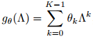
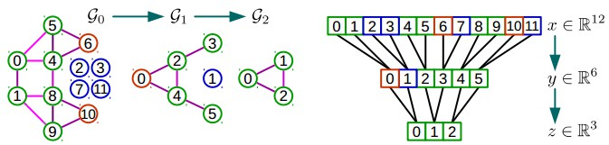

## Convolutional Neural Networks on Graphs with Fast Localized Spectral Filtering

##### **研究主题：解决什么问题，以前的研究通常是怎样解决的**

将神经网络从低维图像、视频推广到高维不规则图结构，本文将CNN推广到图上，定义了Localized Graph Filtering,以便有效地进行评估和学习

本文在谱图理论的基础上提出了一种基于局域网的快速卷积滤波器的构造方法，为图的局域化卷积滤波器的设计提供了必要的数学背景和有效的数值计算方法。

##### **解决问题/创新点：与其他研究有什么不同，最大的不同点是什么**

1.谱图理论陈述：在已有的图信号处理工具(GSP)的基础上，建立了基于图的CNN的谱图理论公式

2.增强局部过滤器：证明了所提出的光谱滤波器的增强是严格局限在半径为*K*的球面上的

3.低计算复杂度：滤波器复杂度线性

4.有效的池化：提出了一种在将顶点重新排列为二叉树结构之后的类似于一维信号池化的有效的图的池化方法

5.实验结果：我们进行了多个实验，最终表明我们的公式是**(i)**一个有用的模型，**(ii)**计算高效，**(iii)**在准确性和复杂性上都优于[文献[4]](https://arxiv.org/abs/1312.6203)中引入的先驱谱图 CNN。我们的图形公式对 MNIST执行类似于一个经典的 CNN，并研究了各种图结构对性能的影响。用于重现我们的结果并将模型应用于其他数据的 [TensorFlow[1]](https://arxiv.org/abs/1603.04467v1)代码作为开源软件数据库提供。

#####  **研究方法：提出框架、算法等**

将CNN推广到图需要三个基本步骤:**(i)**图局部卷积滤波器的设计，**(ii)**将相似顶点组合在一起的图粗化过程，**(iii)**用图池化操作换取更高的滤波器分辨率。

**(i)**图局部卷积滤波器的设计

Learning Fast Localized Spectral Filters：文中指出，在空间域中，将图进行转换的过程中没有确定的公式进行定义；在谱域中，提供了一个*Kronecker delta*卷积定义了良好的局部化算子。同时尽管谱域定义的Filtering不是局部化且时间复杂度较大，但是通过添加参数可以解决。

Graph Fourier Transform(图傅里叶变换)：傅里叶变换是将时域上的函数转换为频域上的函数，***时域上的函数进行卷积***等于***频域上的函数进行内积***

Spectral filtering of graph signals(图信号的谱滤波)：

Polynomial parametrization for localized filters(局部滤波器的多项式参数)：非参数滤波器的两个缺陷：**(i)**空间中他们是不局部化，**(ii)**学习复杂度为*O(n)*，即数据维度。通过使用多项式滤波器可以克服两个缺陷。

使用拉普拉斯多项式的 *k* 阶多项式表示的谱滤波器完全是*k*局部。此外，它们的学习复杂度为 *O(k)*，即滤波器的支持大小，因此与经典 CNNs 具有相同的复杂度。

Recursive formulation for fast filtering(快速滤波的递推公式)：由于与傅里叶基*U*的相乘运算导致学习复杂度O($n^2$)，解决办法为：**(i)**应用切比雪夫多项式展开，**(ii)**应用Lanczos算法构建Krylov子空间的标准正交基。

Learning filters(学习滤波器):

**(ii)**将相似顶点组合在一起的图粗化过程

we  are  most  interested  in  multilevel  clustering  algorithms where  each  level  produces  a  coarser  graph  which  corresponds  to  the  data  domain  seen  at  a different resolution. Moreover, clustering techniques that reduce the size of the graph by a factor two at each level offers a precise control on the coarsening and pooling size. In this work, we make use  of  the  coarsening  phase  of  the  Graclus  multilevel  clustering  algorithm ,  which  has  been shown  to  be  extremely  efficient  at  clustering  a  large  variety  of  graphs. 

(我们最感兴趣的是多级聚类算法，其中每个级别会产生一个粗图，对应于不同分辨率下看到的数据域。此外，聚类技术通过在每个级别上减少两个因素来减小图的大小，从而提供了对粗化和池大小的精确控制。在这项工作中，我们利用粗化阶段的 **Graclus 多级聚类算法**，这已被证明是非常有效的聚类各种图。)

**(iii)**用图池化操作换取更高的滤波器分辨率

为了使Pooling更加高效*(i)*创建一个平衡二叉搜索树和*(ii)*重新排列顶点

##### **研究数据：实验中用到的数据，如何使用**

 

##### **结果分析：有哪些分析？递进实验还是并行实验？分析结果简单总结**

#####  **讨论点：从哪些方面进行讨论？**

 

##### **研究缺陷/展望：作者总结的缺陷有哪些？阅读文献后总结的缺点是否与作者相同？基于这个研究我们可以扩展哪些研究？**
