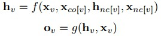
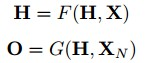
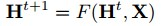
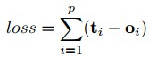
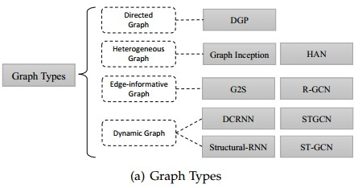
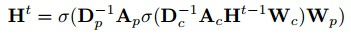
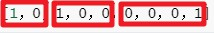

## Graph Neural Networks A Review of Methods and Applications

### 图形神经网络方法及其应用综述

##### **研究主题：解决什么问题，以前的研究通常是怎样解决的**

本文对现有的图神经网络模型*(GNN)*进行详细的回顾，对其应用进行系统的分类，并提出四个有待进一步研究的问题。


##### 1. INTRODUCTION

- As  a  unique  non-Euclidean data  structure  for  machine  learning,  graph  analysis  focuses  on node  classification,  link  prediction,  and  clustering. 

- We found the keys of CNNs: local connection, shared weights and the use of multi-layer. These are also of great importance in solving problems of graph domain, because **1) **graphs are the most typical locally  connected  structure.  **2)**  shared  weights  reduce  the computational  cost  compared  with  traditional  spectral  graph theory.  **3)**  multi-layer  structure  is  the  key  to  deal  with hierarchical patterns, which captures the features of various sizes. 

- graph  embedding  method  based  on  representation  learning*(基于图嵌入的特征表征学习)*suffer two 
  severe drawbacks.First, no parameters are shared between nodes in the encoder, which leads to computationally inefficiency, since it means the number of parameters grows linearly with the number of nodes. Second, the direct embedding methods lack the ability  of  generalization,  which  means  they  cannot  deal  with dynamic graphs or generalize to new graphs.


*1.* 对现有的图神经网络模型进行详细回顾。介绍了最初的模型，它的变体和几个通用的框架。研究了这一领域的各种模型，并提供了一个统一的表示方式来表示不同模型中的不同传播步骤。通过识别相应的聚合器和更新器，
可以很容易地使用我们的表示区分不同的模型。

*2.* 系统地对应用进行分类，并将应用划分为结构化场景、非结构化场景和其他场景。我们为每个场景介绍了几个主要的应用及其相应的方法。

*3.* 提出了四个需要进一步研究的问题。


##### 2. MODELS

###### 2.1 Graph Neural Networks

Let $f$ be a parametric function, called local transition function, that is shared among all nodes and updates the node state according to the input neighborhood. And let $g$ be the local output function that describes how the output is produced. 



where $F$ , the global transition function, and $G$, the global output function are stacked versions of $f$ and $g$ for all nodes in a graph, respectively.



With the suggestion of *Banach’s* fixed point theorem, GNN uses the following classic iterative scheme for computing the state:



Note that the computations described in $f$ and $g$ can be interpreted as the feedforward neural networks. The  learning algorithm is based on a gradient-descent strategy. The loss can be written as follow:



***Limitations:*** 

Firstly,  it  is  inefficient  to update the hidden states of nodes iteratively for the fixed point. If relaxing the assumption of the fixed point, we can design a multilayer  GNN  to  get  a  stable  epresentation  of  node  and  its neighborhood.  

*(更新节点的隐藏状态低效)*

Secondly,  GNN  uses  the  same  parameters  in  the iteration  while  most  popular  neural  networks  use  different parameters  in  different  layers,  which  serve  as  a  hierarchical feature extraction method. Moreover, the update of node hidden states  is  a  sequential  process  which  can  benefit  from  the  RNN kernel like GRU and LSTM. 

*(GNN 在迭代过程中使用相同的参数，而大多数流行的神经网络在不同的层次上使用不同的参数，作为
一种层次化的特征提取方法。)*

Thirdly, there are also some informative features on the edges which cannot be effectively modeled in the original GNN.

*(在边缘上也存在一些信息特征，这些特征在原始的GNN中不能有效地建模。)*


###### 2.2 Variants of Graph Neural Networks



- Directed  Graphs



where $D_p^{-1}A_p$ and $D_c^{-1}A_c$are the normalized adjacency matrixf or parents and children respectively.

- Heterogeneous  Graphs

  处理异构图最简单的方法是将每个节点的类型转换为与原始特征连接的one-hot vector。

  ```python
  #举例
  性别特征：["男","女"]，按照N位状态寄存器来对N个状态进行编码的原理，处理后应该是这样的（这里有两个特征，N=2）：
  
  男  =>  10
  女  =>  01
  
  祖国特征：["中国"，"美国，"法国"]（N=3）：
  
  中国  =>  100
  美国  =>  010
  法国  =>  001
  
  运动特征：["足球"，"篮球"，"羽毛球"，"乒乓球"]（N=4）：
  
  足球  =>  1000
  篮球  =>  0100
  羽毛球  =>  0010
  乒乓球  =>  0001
  
  所以，当一个样本为["男","中国","乒乓球"]的时候，完整的特征数字化的结果为：
  [1，0，1，0，0，0，0，0，1]
  ```

  

  ```python
  #One-hot 编码
  #One-Hot编码，又称为一位有效编码，主要是采用N位状态寄存器来对N个状态进行编码，每个状态都由他独立的寄存器位，并且在任意时候只有一位有效。
  
  #One-Hot编码是分类变量作为二进制向量的表示。这首先要求将分类值映射到整数值。然后，每个整数值被表示为二进制向量，除了整数的索引之外，它都是零值，它被标记为1。
  
  #python表示
  
  from sklearn import preprocessing  
     
  enc = preprocessing.OneHotEncoder()  
  enc.fit([[0,0,3],[1,1,0],[0,2,1],[1,0,2]])  #这里一共有4个数据，3种特征
     
  array = enc.transform([[0,1,3]]).toarray()  #这里使用一个新的数据来测试
     
  print array   # [[ 1  0  0  1  0  0  0  0  1]]
  ```

  

- Graphs  with  Edge  Information


##### **解决问题/创新点：与其他研究有什么不同，最大的不同点是什么**


#####  **研究方法：提出框架、算法等**


##### **研究数据：实验中用到的数据，如何使用**


##### **结果分析：有哪些分析？递进实验还是并行实验？分析结果简单总结**


#####  **讨论点：从哪些方面进行讨论？**


 **研究缺陷/展望：作者总结的缺陷有哪些？阅读文献后总结的缺点是否与作者相同？基于这个研究我们可以扩展哪些研究？**

