## Integrating multi source big data to infer building functions

### 融合多源大数据推断建筑功能

*KEYWORDS: Multi-source big data; density-based method; building functions*

##### ***ABSTRACT***

​	对城市建筑物功能分析有助于为决策者评估、改进城市规划的有效性奠定基础。但尽管如此，迄今为止很少有学术研究能够成功地将**多源”大数据”**整合到建筑物一级的城市土地使用情况中。

​	本研究综合了**多源"大数据**(微信用户的实时位置记录、出租车GPS轨迹数据、兴趣点(POI)数据和高分辨率Quickbird图像的建筑足迹数据)，并将所提出的基于密度的方法应用于**广州天河区**城市建筑物的功能推断。

​	1. 使用微信用户数据比使用出租车数据识别住宅楼、办公室和城中村的结果更好。相反，购物中心、酒店和医院更容易通过出租车数据识别。	2. 在建筑尺度上，综合使用多源大数据比单源大数据更有效地揭示人类动力学与城市综合体之间的关系。

##### ***Introduction***

​	研究中，大数据的使用特别重要，这些研究旨在确定特定人口与其经常出现的地点之间的日流动模式。这种模式——例如，通过证实人们通常在上午离家，晚上在工作日回家，而在工作场所出现相反的模式——为研究人员提供了对特定地点的社会功能的洞察力。通过使用出租车GPS轨迹数据、社交媒体数据和其他类似来源观察这种日常活动，使研究者能够区分人们的活动，从而确定某一块土地所对应的不同社会功能。本文的目的是将**多源大数据**和高分辨率 Quickbird 建筑物足迹相结合，以推断城市建筑物功能。

##### ***Related work***

​	*Liu et al.(2012)*利用上海的出租车 GPS 数据识别大规模的土地利用类别。

​	*Yuan et al.(2012)*使用基于主题的推理模型推断出北京各种建筑的功能。

​	*Pan et al.(2013)*利用 4000 辆出租车的跟踪数据，探讨了杭州土地的社会功能。

​	*Liu et al.(2015a)*使用一个两层次的多中心城市结构模型来研究上海城市空间的相互作用。

​	*Pei et al.(2014)*利用新加坡的移动电话数据，采用半监督的模糊 C-均值聚类方法，以识别不同类型的土地使用。

​	结合土地利用、交通和环境模型，利用 POI 数据，*Jiang et al.(2015)*通过对人类活动进行分析，能够在普查区域层面评价灾害性土地利用。

​	*Zhan et al.(2014)*利用大规模社交媒体签到数据推断纽约市土地使用类型的有效性进行了全面调查。

​	*Frias-Martinez and Frias-Martinez(2014)*通过聚类在曼哈顿，纽约市(美国)，伦敦(英国)和马德里(西班牙)收集的Twitter 数据对城市土地使用分类。

​	*Zhong et al.(2014)*综合了两个数据源(*surveys and smartcard data*)来推断新加坡两个地区的建筑功能。

​	利用、分析来自一系列来源的大数据和遥感数据，将使研究人员获得有关所研究的地理环境的一系列不同方面的信息。目前，多种类型数据的集成是一个特别有吸引力的课题*(Liu et al. 2015b)*。

​	Being mindful of these problems, in this study we attempted to infer building functions using  multisource  big  data. 

​	The major contributions of this paper are four-fold. First, we were able to fuse taxi data, WeChat data, and building footprint areas taken from highresolution Quickbird images. Second, we proposed a density-based method in order to infer building functions. Third, we applied this methodology through a case study of the Tianhe District of Guangzhou, in China. Finally, we also developed a novel method that was used to verify our experimental results, using ground-truth investigation data. The final results showed an overall detection rate of 72.22% and an accuracy rate that was above 65%.

##### ***Study area and data***

​	

​	This study used four data sets relating to Tianhe District: a building footprint dataset, a taxi dataset, a WeChat dataset, and a POI database and street view taken from Baidu Map. 

​	First dataset:	We used high-resolution Quickbird images from 2015 to support the visual interpretation required to obtain relevant building footprints. Through this process, we successfully extracted the footprints of 68,997 buildings.

​	Second dataset:	城市中每天都会产生大量的出租车数据记录。这些数据记录标有上车或下车的时间和地理位置，是建立人类活动模型的宝贵信息，可作为描述主要城市建筑功能的替代措施。本实验中，选取在*2014年5月5日( 星期一)*和*2014年5月16日( 星期六)*在天河区工作的 25,000 辆的士作为样本，共有 600 万项记录。We constructed a dataset to concentrate on the reciprocities between buildings and to simplify taxi trajectories into vectors composed of origins, destinations, and times.

​	Third dataset:	第三个数据集是实时的微信用户密度信息。为了获得这些实时数据，我们从 *Easygo (http://ur.tencent.com*开发了一款基于*onanAPI(应用程序/程序/地理界面)*的网络爬虫来记录我们研究区域的实时微信用户数据。收集了 *2015年6月15日至21日*每小时的微信用户密度数据，空间分辨率为 25米。考虑到人们在工作日和非工作日通常有不同的活动，选择天河区工作日*(2015年6月15日)*和非工作日*(2015年6月20日)*的微信数据进行研究。

​	Fourth dataset:	利用了一个 POI 数据库(包括大约 40,000 条记录)和百度地图的街景数据。POI 数据库提供给定点位置的详细实际信息，包括该位置的名称、地址和类别。设计了一个网络爬虫，它使用百度地图 API 来记录覆盖研究区域的 17类 POI 数据。选择 6 个最高的 POI 类型：学校(小学/中学/高中/技术学校/大学)，办公大楼(企业/金融服务/政府机构)，购物大楼(超市/商场)，医院(包括诊所)，酒店和住宅小区。

##### ***Methodology***

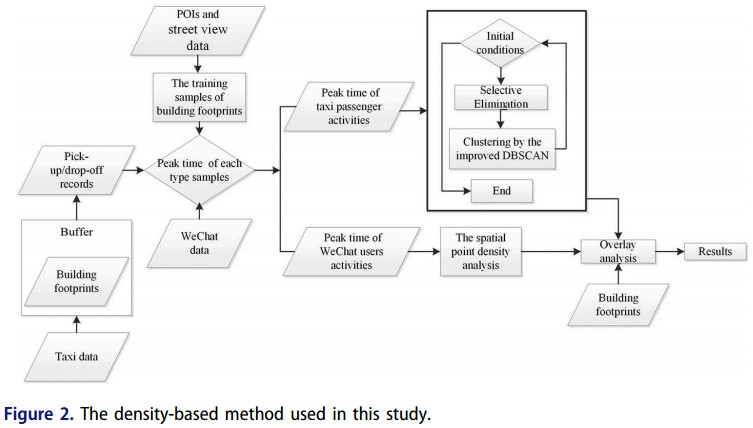

​	该方法集成了三个步骤：首先，以出租车载客点和下客点的个体行为指标建立城市建筑物之间的关系，然后利用改进的基于密度的噪声空间聚类算法(改进的DBSCAN)对城市建筑物进行聚类。其次，利用空间点密度分析方法对来自微信的社交媒体数据进行分析。第三，根据一套确定的评价规则推导出建筑功能。

通过以下六个步骤确定评价规则：

1. 建立了个人层面的行为(从出租车乘客上车、下车地点和微信用户活动的角度来理解)和城市建筑之间的空间联系。

2. 通过对训练样本的分析，确定了各类建筑物的峰值活动时间。
3. 然后使用改进的 DBSCAN 算法对出租车乘客上、下车记录进行聚类。
4. 然后对实时微信用户位置记录进行空间点密度分析。
5. 将第三步的聚类结果与第四步的密度分析结果相结合。
6. 定义了推断建筑物功能的评价准则。

###### ***A density-based method***

​	根据百度地图的 POI 分类和 *Zhong et al.(2014)*定义的建筑类型，我们可以定义天河区的 7 种建筑类型，即:住宅建筑、城中村(*Linet al. 2011*)、办公大楼、购物中心、酒店、医院和学校。

​	根据广州市城市规划局提供的广州市城市土地利用分类图，计算了广州市居住建筑、办公楼、购物中心、宾馆、医院、学校的比例。

**城中村的区分、辨别：**	此外，人类活动在居住小区和城市村庄是相似的，很难区分这些类型的建筑。*Wang et al.(2009) and Lin et al.(2011)*指出，在中国大多数城中村，建筑物(不包括未经批准的建筑)通常不超过 4 层，面积不
超过 480 平方米。此外，许多城中村往往位于建筑密度达到或超过**70%**的中央商务区附近。根据居住小区与城中村的差异，将城中村与居住小区分开。

​	**1.** 确定个人层次行为与城市建筑之间的空间联系

​	一般而言，的士乘客上、落客地点与实际目的地有一段距离。通过后续的缓冲区分析，我们可以对出租车客上落、点与其经常出入的城市建筑物之间的空间关系进行理解。将采集到的微信数据集合起来构建一个由位置和时间数据组成的数据集。每个记录都以 25 米的空间分辨率记录了楼层微信用户的密度。

​	**2.** 利用训练样本获取各类建筑物的峰值时间

​	根据每一类型建筑在案例研究区域的流行程度(以该类型建筑的数量占总数的比例计算)，我们从* *型建筑功能类型($m_k$代表建筑功能类型*k*的样本数)中选择 *m*样本。关于这些示例函数类型的信息是从百度地图的兴趣点(POIs)和街道视图中获得的。选择这些训练样本建筑的目的是为了获得研究中提到的每种类型建筑的高峰时间。计算出样本组中每种类型建筑物$A_k(A_{k,p},A_{k,d},A_{k,w},k = 1,2...K)$出租车乘客上下车的平均数和实时微信用户的平均数:
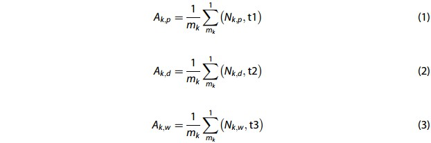

​	其中，$A_{k,p}$是在*t1*时间内样本构建缓冲区内构建建筑物功能类型*k*的平均上车次数;$A_{k,d}$是在*t2*时间内样本构建缓冲区内构建建筑物功能类型*k*的平均下车次数。$A_{k,w}$是在*t3*时间内样本构建缓冲区内构建建筑功能类型*k*在样本建筑物内的平均实时微信用户数。$N_{k,p}$表示构建缓冲区中构建函数类型*k*的上车次数之和;$N_{k,d}$表示示例构建缓冲区中构建函数类型*k*的下车次数之和。$N_{k,w}$是样本在建造功能类型*k*中实时微信用户的总数;*t1*是上车时间，*t2*是下车时间，*t3*是微信用户活动时间;$m_k$是样本建筑中建筑功能类型*k*的总数，$k\in[1,K],t_1,t_2,t_3\in[0,24]$.

​	**3.使用改进的 DBSCAN 算法对出租车数据进行聚类**

​	的士数据的分布并不规则，而且在的士数据中有许多噪音来源(例如，上车/下车位置偏差)。DBSCAN算法结构简单，计算效率高，可以处理高密度数据生成任意形状的聚类，并消除空间数据噪声(ertzetal.2003)。

​	**Εps邻域**：给定对象半径为Εps内的区域称为该对象的Εps邻域

​	Definition 1 : *(Eps-neighborhood of a point)* $N_{Eps}(p) = {\lbrace q \in D|L(p,q)\leq Eps\rbrace}$ $L(p,q)$ is the Euclidean distance from *p to q*.

​	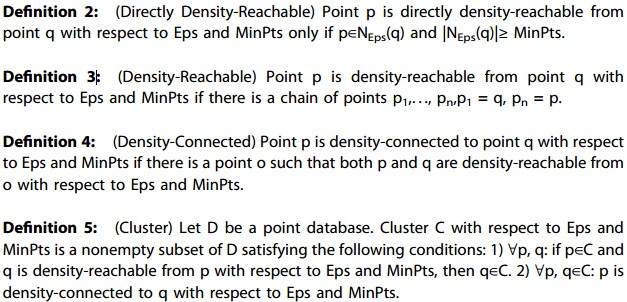

​	*(*

​	*Difinition 2： 对于样本集合D，如果样本点q在p的Ε邻域内，并且p为核心对象，那么对象q从对象p直接密度可达*

​	*Difinition 3 : 对于样本集合D，给定一串样本点p1,p2….pn，p= p1,q= pn,假如对象pi从$p{i-1}$直接密度可达，那么对象q从对象p密度可达。*

​	*Difinition 4 : 存在样本集合D中的一点o，如果对象o到对象p和对象q都是密度可达的，那么p和q密度相联。*

*)*

​	DBSCAN 中有两个重要参数：聚集半径参数 *Eps* 和邻域密度阈值 *MinPts*。

​	**改进DBSCAN**
​	普通的欧几里得距离在本实验中不合理，在研究中使用**街道网络距离**作为距离的衡量标准被认为是合理的。

​	*MinPts* 设置为数据总量的*1/25*

​	首先，对数据集运用评估函数用以侦测噪声点。

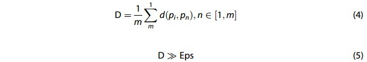

*(Where pi is the initial point, pn is the point group around pi, d is the street network distance between points, and D is the average street network distance of all points in the cluster.)*

​	为了解决参数敏感性问题和不均匀数据集问题，采取以下步骤。算法的初始化包括四个步骤:1)设置周期时间;2)随机选取一个点 p;3)确定点 p的近距离点群 k;4)根据每个点与点 p 之间的距离按降序排序;5)将点与步骤 3 之间的最近距离分配给 Eps。

​	其次，一种建筑类型的推断会对其他建筑类型的推断产生不利影响。我们使用“*Selective Elimination*”方法来解决这个问题，例如，当我们推断一种建筑类型(例如，办公楼群)，附近其他建筑类型(例如，住宅楼宇，商业楼宇等)的士上车和下车的记录在计算中被删除。

​	最后，利用改进的 DBSCAN 算法对天河出租车高峰时段的上下车记录进行聚类。

​	**4. 分析微信数据，定义推断建筑功能的评估规则**

​	使用 ArcGIS10.2 进行了空间点密度分析，使我们能够提取出微信用户在高峰期的位置。我们假设功能相似的建筑物在出租车乘客上、下车和微信用户活动方面有相似的高峰时间。根据这一假设，定义了一个评价规则来推断公式(6)中的构造函数。

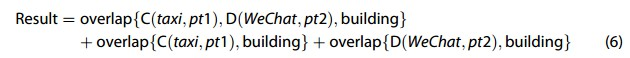

​	*pt1*是特定类型建筑物内出租车乘客上、下车的高峰时间，*pt2*是特定类型建筑物内微信用户活动的高峰时间，*c*是出租车数据的聚类结果，*d*是微信数据空间点密度分析的结果。

​	我们将出租车数据的聚类结果、微信数据的空间点密度分析结果和天河的建筑足迹结合起来，在 ArcGIS10.2 中进行叠置分析。

​	建筑功能的推断是从一种类型到另一种类型，我们推断建筑功能为一种类型，当我们推断建筑功能为另一种类型，同一建筑被确定为另一种类型。如果是这种情况，我们定义该建筑具有混合功能。

##### ***Results***

​	我们得到了每种建筑类型的比例:住宅(54.34%)，学校(10.13%)，办公室(9.39%)，购物(3.58%)，酒店(2.46%)和医院(15.21%)。然后使用这些比例确定建筑推理序列如下:1.住宅楼宇(包括城中村)	2.学校	3.办公室	4 .购物大楼	5 .酒店	 6 .医院。

​	(1)建立出租车乘客活动与城市建筑之间的空间关系。在进行这种分析时，重要的是确定不同类型建筑物的最佳缓冲距离。我们在研究区随机选取 7 幢建筑物，以这些建筑物代表建筑物类型，计算这些建筑物的缓冲区内*(1 米
至 40 米)*在 *3 小时内(上午 9:00 至中午 12:00)*(通常是人类活动的高峰期)的上、下客量。

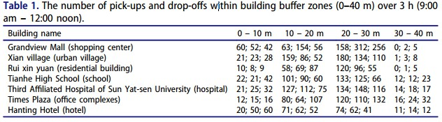

(a)指住宅楼宇、(b)指办公大楼、(c)指购物大楼、(d)指酒店、(e)指医院，(f)指学校。*Ap*上车、*Ad*下车、*Aw*指微信用户，*0-24*表示工作日，*24-48*表示休息日。

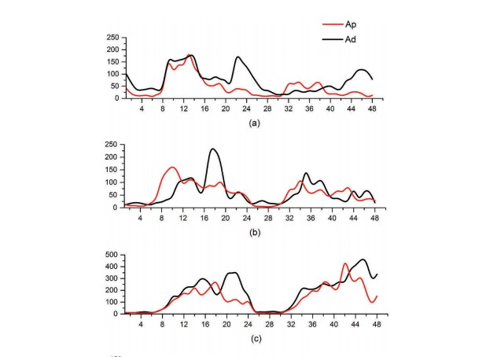

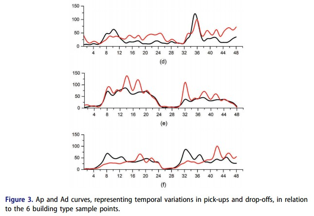

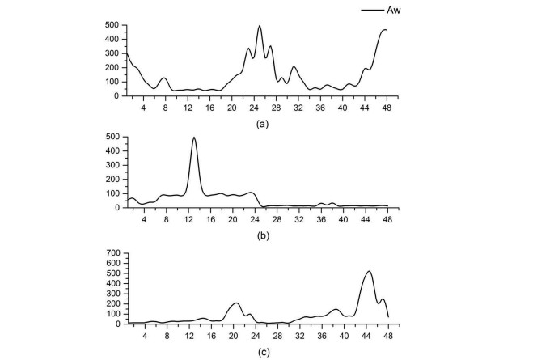

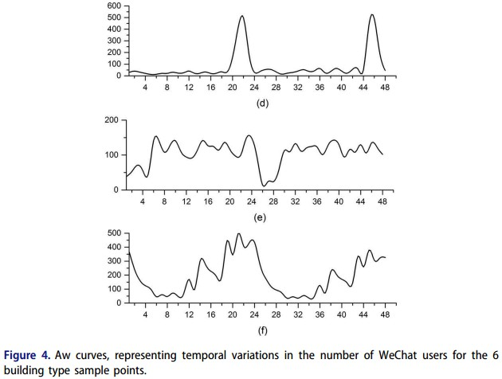

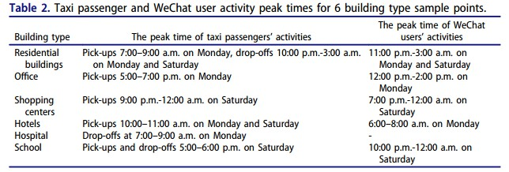

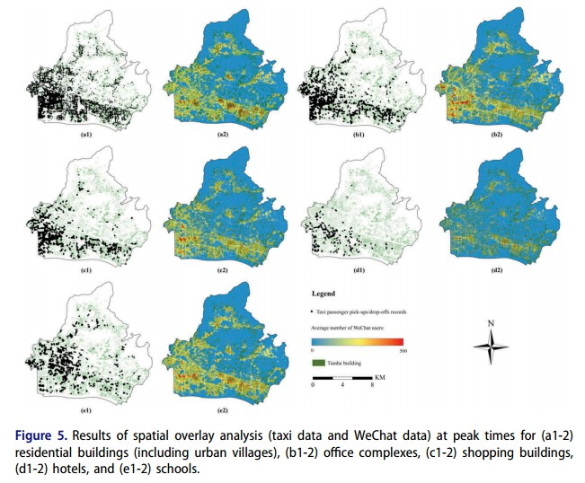

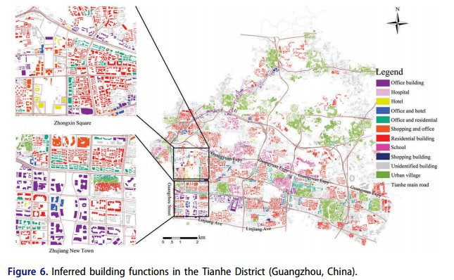

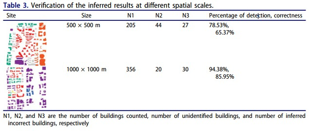

​	

##### ***Discussion***

**The size of the training sample influences the inferred detection rate.**

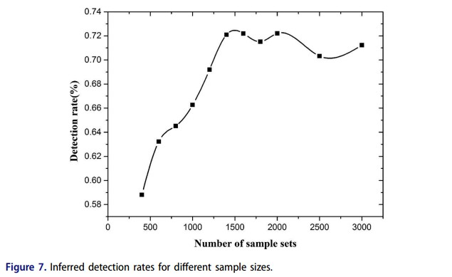

**Multi-source data integration advantage**

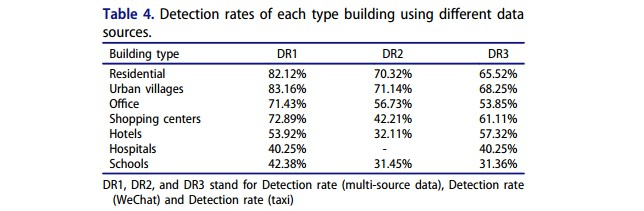

##### ***Conclusions***

​	本文提出了一 种基于密度的多源“大数据”集成构造函数的方法。我们的评估和比较证实，微信数据在通过基于推理的方法识别建筑类型方面具有优势——在这项研究中，住宅建筑、办公室和城中村的情况明显如此。相反，购物中心、酒店和医院更容易通过出租车数据识别。
