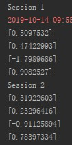
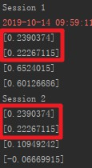
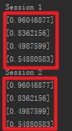

# [random tensor-随机生成种子操作(tf.set_random_seed(interger))](https://www.cnblogs.com/happy-sir/p/11530528.html)

random seed操作其实分为两种：graph-level（图级）和op-level（操作级），随机数生成种子是在数据流图资源上运作的，接下来让我具体介绍它们。

第一种情况：在Session中生成不同的序列，既不设置图级别也不设置op级别种子：

```python
import tensorflow as tf

#tf.random_uniform((m, n), minval=low,maxval=high,dtype=tf.float32)))返回m*n的矩阵，产生于low和high之间，产生的值是均匀分布的。
a = tf.random_uniform([1])

#生成正态分布随机数tf.random_normal(shape, mean=0.0, stddev=1.0, dtype=tf.float32, seed=None, name=None)
b = tf.random_normal([1])

print( "Session 1")
with tf.Session() as sess1:
  print (sess1.run(a))  # generates 'A1'
  print (sess1.run(a))  # generates 'A2'
  print (sess1.run(b))  # generates 'B1'
  print (sess1.run(b))  # generates 'B2'
 
print( "Session 2")
with tf.Session() as sess2:
  print (sess2.run(a))  # generates 'A3'
  print (sess2.run(a))  # generates 'A4'
  print (sess2.run(b))  # generates 'B3'
  print (sess2.run(b))  # generates 'B4'
```

可以明显看出，无论是在同一个Session还是在不同的Session中，生成的序列都不同。




第二种情况：为跨Session生成相同的可重复序列，请为op设置种子：

```python
import tensorflow as tf
 
a = tf.random_uniform([1], seed=1)     #op-level 随机生成种子
b = tf.random_normal([1])
 
print( "Session 1")
with tf.Session() as sess1:
  print (sess1.run(a))  # generates 'A1'
  print (sess1.run(a))  # generates 'A2'
  print (sess1.run(b))  # generates 'B1'
  print (sess1.run(b))  # generates 'B2'
 
print( "Session 2")
with tf.Session() as sess2:
  print (sess2.run(a))  # generates 'A3'
  print (sess2.run(a))  # generates 'A4'
  print (sess2.run(b))  # generates 'B3'
  print (sess2.run(b))  # generates 'B4'
```

明显可以看出在op-level级随机生成种子的操作后，同一个Session内生成不同的序列，跨Session生成相同的序列。




第三种情况：要使所有生成的随机序列在会话中可重复，就要设置图级别的种子：

```python
import tensorflow as tf
 
tf.set_random_seed(1234)
a = tf.random_uniform([1])
b = tf.random_normal([1])
 
print( "Session 1")
with tf.Session() as sess1:
  print (sess1.run(a))  # generates 'A1'
  print (sess1.run(a))  # generates 'A2'
  print (sess1.run(b))  # generates 'B1'
  print (sess1.run(b))  # generates 'B2'
 
print( "Session 2")
with tf.Session() as sess2:
  print (sess2.run(a))  # generates 'A3'
  print (sess2.run(a))  # generates 'A4'
  print (sess2.run(b))  # generates 'B3'
  print (sess2.run(b))  # generates 'B4'
```

