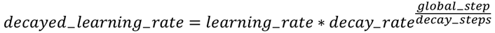
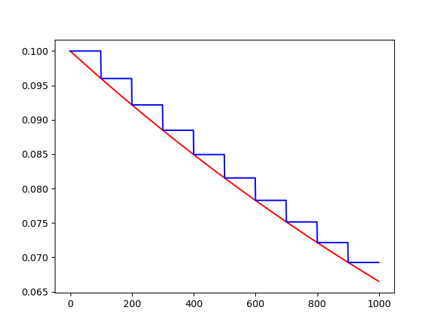

# [TensorFlow 中的tf.train.exponential_decay() 指数衰减法](https://www.cnblogs.com/gengyi/p/9898960.html)

```python
exponential_decay(learning_rate, global_step, decay_steps, decay_rate, staircase=False, name=None)
```

使用方式为

```python
tf.train.exponential_decay( )
```

在 Tensorflow 中，exponential_decay()是应用于学习率的指数衰减函数（实现指数衰减学习率）。

在训练模型时，通常建议随着训练的进行逐步降低学习率。该函数需要`global_step`值来计算衰减的学习速率。

该函数返回衰减后的学习率。该函数的计算方程式如下



 

```python
参数：

- learning_rate - 初始学习率
- global_step - 用于衰减计算的全局步骤。 一定不为负数。喂入一次 BACTH_SIZE 计为一次 global_step
- decay_steps - 衰减速度，一定不能为负数，每间隔decay_steps次更新一次learning_rate值
- decay_rate - 衰减系数，衰减速率，其具体意义参看函数计算方程(对应α^t中的α)。
- staircase - 若 ‘ True ’ ，则学习率衰减呈 ‘ 离散间隔 ’ （discrete  intervals），具体地讲，`global_step / decay_steps`是整数除法，衰减学习率（ the decayed  learning rate ）遵循阶梯函数；若为 ’ False ‘ ，则更新学习率的值是一个连续的过程，每步都会更新学习率。

返回值：

- 与初始学习率 ‘ learning_rate ’ 相同的标量 ’ Tensor ‘ 。

 优点：

- 训练伊始可以使用较大学习率，以快速得到比较优的解。
- 后期通过逐步衰减后的学习率进行迭代训练，以使模型在训练后期更加稳定。
```


```python
import tensorflow as tf
import matplotlib.pyplot as plt

learning_rate = 0.1
decay_rate = 0.96
global_steps = 1000
decay_steps = 100

global_step = tf.Variable(0, trainable = Fasle)
c = tf.train.exponential_decay(learning_rate, global_step, decay_steps, decay_rate, staircase=True)
d = tf.train.exponential_decay(learning_rate, global_step, decay_steps, decay_rate, staircase=False)

T_C = []
F_D = []

with tf.Session() as sess:
    for i in range(global_steps):
        T_c = sess.run(c, feed_dict={global_step: i})
        T_C.append(T_c)
        F_d = sess.run(d, feed_dict={global_step: i})
        F_D.append(F_d)

plt.figure(1)
plt.plot(range(global_steps), F_D, 'r-')
plt.plot(range(global_steps), T_C, 'b-')

plt.show()
```




备注：

（1）

台阶形状的蓝色线是 staircase = True

线条形状的红色线是 staircase = Fasle

（2）

初始学习率 learning_rate 为0.1，总训练次数 global_setps 为 1000  次；staircase=True时，每隔 decay_steps = 100 次更新一次 学习率  learning_rate，而staircase=True时，每一步均会更新一次学习率 learning_rate ，

（3）

训练过程中，decay_rate的数值保持步不变。