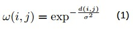
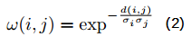
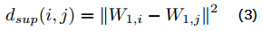
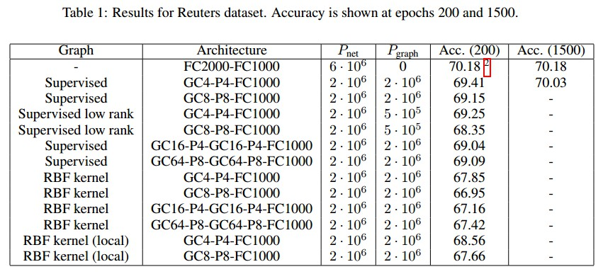
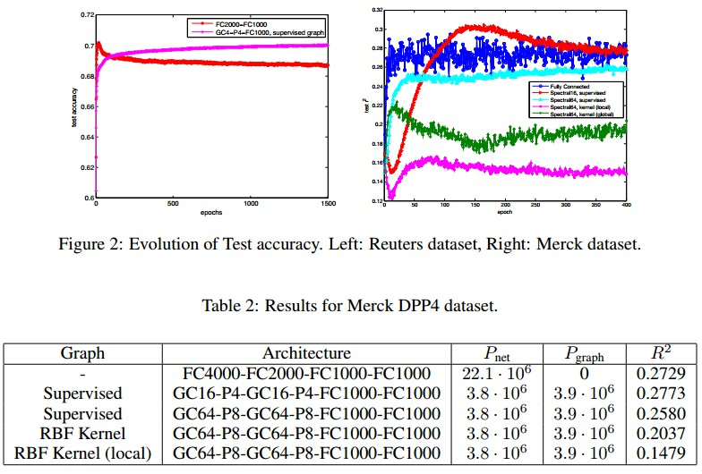
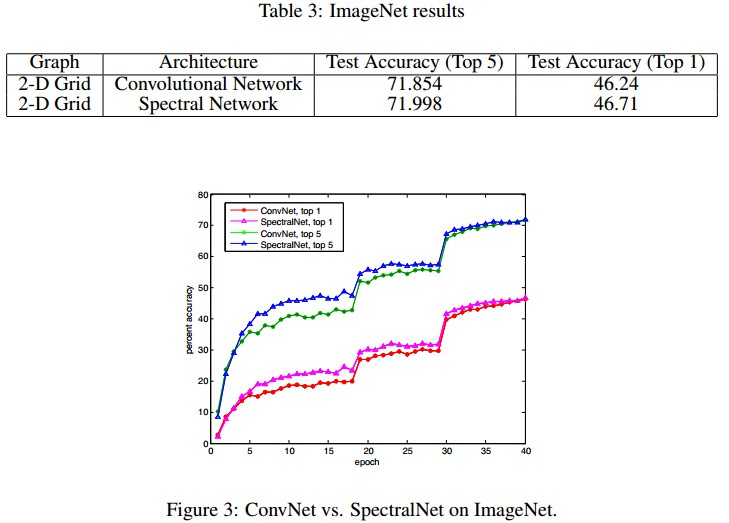

## Deep Convolutional Networks on Graph-Structured Data

### 基于图结构数据的深度卷积网络

##### **研究主题：解决什么问题，以前的研究通常是怎样解决的**

本文讨论了在一般非欧几里德域上构造学习复杂度小的深度体系结构的问题，通常这些域是未知的，需要根据数据进行估计。我们开发了一个扩展性的谱网络，包含了一个图估计程序。

先前的研究已经使用局部感受野对建筑进行探索，大多数应用于图像识别。

曾有提出过一个方案，学习如何基于无监督学习条件下通过相似性度量将特征组合在一起。

最近，提出了通过图的拉普拉斯算子将卷积推广到图结构。

##### **解决问题/创新点：与其他研究有什么不同，最大的不同点是什么**

1.我们扩展思路到大规模分类问题，尤其是对数据集对象的识别、文本分类和生物信息。
2.在最一般的情况下，没有先验信息的图结构是可用的，并结合监督图卷积提出无监督和新的监督图估计策略。

#####  **研究方法：提出框架、算法等**

**Generalizing Convolutions to Graphs**

*1. Spectral Networks:* A spectral network generalizes a convolutional network through the Graph Fourier
Transform, which is in turn defined via a generalization of the Laplacian operator on the grid to the
graph Laplacian.

*2. Pooling with Hierarchical Graph Clustering:* in order to reduce the complexity of the model, it is often
useful to trade off spatial resolution for feature resolution as the representation becomes deeper.

**Graph Construction**

*1. Unsupervised Graph Estimation:* the simplest approach to estimating a graph structure from the data is to consider a distance between features *i* and  *j*. This distance is used to build a Gaussian diffusion Kernel *(1)*,In our experiments, we also consider the variant of self-tuning diffusion kernel *(2)*.

*2. Supervised Graph Estimation:* A particularly simple approach is to use a fully-connected network to determine the feature similarity. 

the supervised criterion will extract through  $W_1$ a collection of linear measurements that best serve the classification task. Thus two features are similar if the network decides to use them similarly within these linear measurements.

##### **研究数据：实验中用到的数据，如何使用**

In this section we adopt the following notation to describe network architectures: $GCk$ denotes a graph convolution layer with *k* feature maps, $Pk$ denotes a graph pooling layer with stride $k$ and pool size $2k$, and $FCk$ denotes a fully connected layer with $k$ hidden units. In our results we also denote the number of free parameters in the network by $Pnet$ and the number of free parameters when estimating the graph by $Pgraph$.

*(在这一部分我们采用以下标记符号描述网络体系结构：$GCk$表示具有$k$个特征图的图卷积层，$Pk$表示跨度为k以及池化大小为$2k$的图池化层，$FCk$表示具有$k$个隐藏单元的完全连接层。在结果中，我们用$Pnet$表示网络体系中自由参数的个数，$Pgraph$表示图估计时自由参数的个数)*

本文在文本分类、计算生物学和计算机视觉 3 种数据集上进行了实验.

training a spectral network requires an $O(N^2)$ matrix multiplication for each input and output feature map to perform the Graph Fourier Transform, compared to the efficient $O(NlogN)$ Fast Fourier Transform used in classical ConvNets. We found that performing pooling at the beginning of the network was especially important to reduce the dimensionality in the graph domain and mitigate the cost of the expensive Graph Fourier Transform operation.

*1.文本分类:Reuters Dataset:* consists of training and test sets each containing 201,369 documents from 50 mutually exclusive classes.

*2.计算生物学:Merck Molecular Activity Challenge*  The Merck Molecular Activity Challenge is a computational biology benchmark where the task is to predict activity levels for various molecules based on the distances in bonds between different atoms.

*3.计算机视觉:ImageNet* : Our  network  consisted  of  4  convolution/ReLU/max  pooling  layers  with  48,  128,  256  and  256 feature maps, followed by 3 fully-connected layers each with 4096 hidden units regularized with dropout.

##### **结果分析：有哪些分析？递进实验还是并行实验？分析结果简单总结**

比较了全连接网络和 *GC4-P4-FC1000* 网络在200世代以及1500世代的测试精度

**We see that both models yield nearly  identical performance. Interstingly, the spectral  network learns faster than the ConvNet during the first part of training, although both networks converge around the same time. **

#####  **讨论点：从哪些方面进行讨论？**

Convnet 架构的吸引力和成功基于使用低学习复杂度和避免昂贵的矩阵乘法生成高信息量的局部统计的能力。

文中提出的模型需要进行一个复杂度为 $O(N^2)$ 的相似性估计操作，但这使深层模型的学习的复杂性不断增加致使多于一般的完全连接的架构。此外，在特征相似性可以使用未标记数据(如单词表示)估计的情况下，我们的模型从标记数据中学习的参数更少。

 **研究缺陷/展望：作者总结的缺陷有哪些？阅读文献后总结的缺点是否与作者相同？基于这个研究我们可以扩展哪些研究？**

*1.* 在框架中，无论是向前还是向后的计算，都需要图形傅里叶变换的乘法运算，这需要 $O(N^2)$ 的运算成本。这与传统的 Convnet 有很大的不同，后者只需要 $O(N)$。由于Convnets框架中网格的特定对称性，使复杂性达到  $O(nlogN)$ 。一个有待解决的问题是，利用类似于 $FFT$ 的 Givens 分解，是否可以找到一般拉普拉斯图的近似特征基。

*2.* 当输入图结构无先验信息时，图估计是模型的统计瓶颈，一般图需要 $O(N^2)$，*m* 维图需要 $O(MN)$。有监督图估计比基于低阶矩的无监督图估计具有更好的性能。此外，还验证了该体系结构对图形估计误差非常敏感。在有监督的环境中，这个步骤可以通过一个 *Bootstrapping* 机制来看待，在这个机制中，一个最初没有约束的网络可以自我调整，从而变得更加局部化，并且具有权重共享。

*3.* 平稳性和组合性的统计假设并不总是得到验证。在这些情况下，*Model risk*造成的限制降低了它的性能。解决这个问题的一个可能是在输入层和光谱层之间插入完全连接的层，这样数据就可以转换成适当的统计模型。另一个在未来需要考虑的是减少权重共享的概念，通过引入一个*commutation error(换向误差)* $kW_iL-kW_iK$ 与图拉普拉斯算子，它对不与拉普拉斯算子对换的变换施加*soft penalty*，而不是像谱网那样施加*exact commutation*。